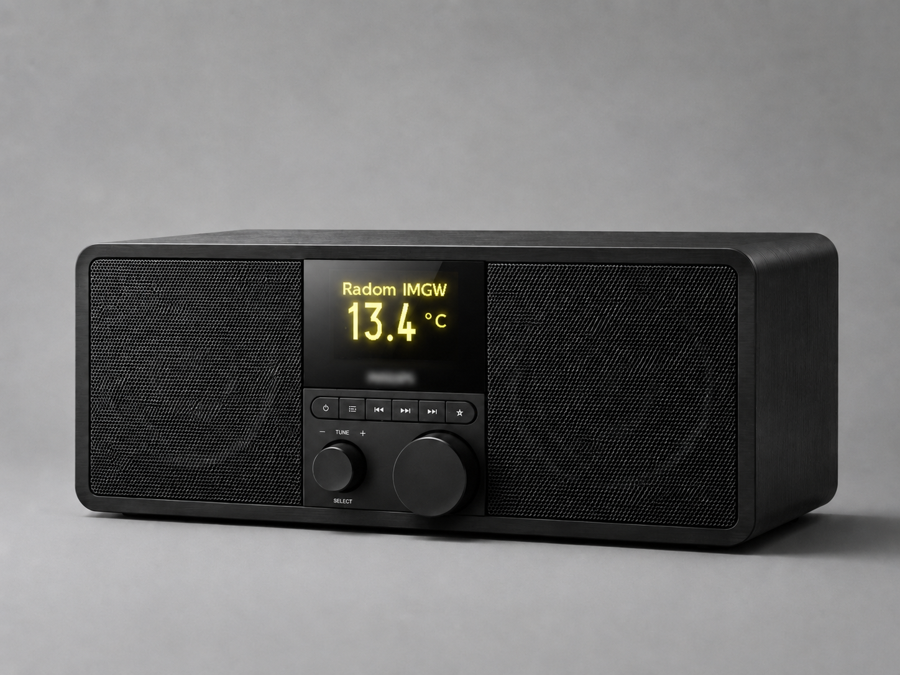

# RadioS3 — radio internetowe na ESP32-S3

Autorskie radio internetowe przygotowane dla płytki **ESP32-S3-DEV-KIT-N16R8-M**.  
Projekt obsługuje odtwarzanie internetowych stacji radiowych, sterowanie enkoderem, wyświetlacz OLED, panel WWW, pogodę IMGW dla Radomia, zegar NTP, aktualizację OTA oraz zapis konfiguracji w pamięci LittleFS.

Kod jest napisany jako pojedynczy plik `.ino` i wykorzystuje nieblokującą pętlę główną z prostym schedulerem opartym o `millis()`.



---

## Najważniejsze funkcje

- radio internetowe Wi-Fi na ESP32-S3,
- obsługa strumieni MP3, AAC, FLAC, OGG oraz M3U8,
- lista maksymalnie 50 stacji radiowych,
- domyślne stacje zapisane w kodzie,
- dodawanie, usuwanie i przełączanie stacji przez panel WWW,
- sterowanie enkoderem obrotowym,
- regulacja głośności,
- menu ekranowe uruchamiane długim naciśnięciem enkodera,
- wyświetlanie aktualnej stacji na OLED,
- zegar NTP z polską strefą czasu,
- temperatura z IMGW dla Radomia,
- ArduinoOTA — aktualizacja firmware przez Wi-Fi,
- automatyczne ponowne łączenie z Wi-Fi,
- automatyczne ponawianie odtwarzania po zerwaniu strumienia,
- health-check streamu audio,
- kontrola wolnej pamięci RAM,
- zapis konfiguracji w LittleFS,
- bezpieczny zapis konfiguracji przez plik tymczasowy i kopię zapasową,
- endpoint `/status` zwracający dane JSON,
- zdalny restart urządzenia przez panel WWW.

---

## Wersja

```text
RadioS3 v1.1
```

Zmiany i poprawki w wersji 1.1:

- urządzenie startuje od razu w trybie pracy,
- menu pojawia się dopiero po długim naciśnięciu enkodera,
- komunikaty startowe Wi-Fi, IP i odtwarzania są widoczne na ekranie,
- poprawione odświeżanie ekranu po wygaszeniu komunikatu,
- stream po błędzie nie poddaje się i ponawia próby połączenia,
- zastosowano narastający backoff przy błędach strumienia,
- OTA zatrzymuje audio na czas aktualizacji,
- postęp OTA jest pokazywany na OLED,
- po błędzie OTA urządzenie wykonuje restart,
- NTP ponawia synchronizację, dopóki czas nie zostanie ustawiony,
- ekran pogody nie miga podczas odświeżania danych.

---

## Sprzęt

Projekt został przygotowany dla:

```text
ESP32-S3-DEV-KIT-N16R8-M
```

Wymagane elementy:

- ESP32-S3 z PSRAM,
- wyświetlacz OLED SSD1306 128×64 SPI,
- enkoder obrotowy z przyciskiem,
- moduł audio I2S / DAC / wzmacniacz zgodny z biblioteką ESP32-audioI2S,
- głośnik,
- stabilne zasilanie USB lub 5 V.

---

## Podłączenie pinów

### OLED SPI

```cpp
OLED_MOSI = 39
OLED_CLK  = 38
OLED_DC   = 40
OLED_CS   = 42
OLED_RST  = 41
```

### Audio I2S

```cpp
I2S_BCLK = 12
I2S_LRC  = 14
I2S_DOUT = 13
```

### Enkoder obrotowy

```cpp
PIN_ENC_A  = 5
PIN_ENC_B  = 6
PIN_ENC_SW = 4
```

---

## Wymagane biblioteki

Projekt korzysta z bibliotek:

```text
ESP32-audioI2S
ArduinoOTA
RotaryEncoder
U8g2
LittleFS
WebServer
WiFi
HTTPClient
WiFiClientSecure
SPI
```

Zweryfikowany stack bibliotek według komentarza w kodzie:

```text
ESP32-audioI2S 3.4.5
U8g2 2.36.19
RotaryEncoder 1.6.0
```

Biblioteka **ESP32-audioI2S 3.4.5** wymaga włączonego PSRAM.

---

## Zalecane ustawienia Arduino IDE

```text
Board: ESP32S3 Dev Module
Flash Size: 16MB
Partition Scheme: 8M with spiffs (3MB APP / 1.5MB SPIFFS)
PSRAM: OPI PSRAM
```

Przykładowe FQBN:

```text
esp32:esp32:esp32s3:PartitionScheme=default_8MB,PSRAM=opi,FlashSize=16M
```

W Arduino IDE nazwa folderu powinna być taka sama jak nazwa pliku `.ino`, czyli:

```text
RadioS3/
└── RadioS3.ino
```

---

## Konfiguracja Wi-Fi i OTA

Przed wgraniem programu uzupełnij dane w pliku `RadioS3.ino`:

```cpp
constexpr char WIFI_SSID[]     = "YOUR_WIFI_SSID";
constexpr char WIFI_PASSWORD[] = "YOUR_WIFI_PASSWORD";
constexpr char OTA_HOSTNAME[]  = "RadioS3";
constexpr char OTA_PASSWORD[]  = "YOUR_OTA_PASSWORD";
```

---

## Domyślne stacje

W kodzie znajdują się przykładowe stacje:

- RMF FM,
- Radio ZET,
- Polskie Radio 1,
- Radio Pogoda,
- Smoothjazz FLAC,
- Radio Radom,
- Radio Maryja,
- Radio Wawa,
- Antyradio.

Listę można zmieniać z poziomu panelu WWW.

---

## Sterowanie

Radio obsługiwane jest enkoderem obrotowym.

Krótkie naciśnięcie:

- zatwierdza wybór,
- uruchamia wybraną stację,
- przechodzi między trybami zależnie od aktualnego ekranu.

Obrót enkodera:

- zmienia głośność,
- wybiera stację,
- przewija pozycje menu.

Długie naciśnięcie około 2 sekundy:

- otwiera menu główne.

Dostępne pozycje menu:

```text
Volume
Stacja
Zegar
Pogoda
Restart
```

---

## Panel WWW

Po połączeniu z Wi-Fi urządzenie uruchamia lokalny panel WWW.

W panelu można:

- sprawdzić adres IP urządzenia,
- sprawdzić wolną pamięć RAM,
- sprawdzić czas działania,
- zobaczyć aktualnie odtwarzaną stację,
- dodać nową stację,
- usunąć stację,
- przełączyć odtwarzanie na wybraną stację,
- wykonać restart urządzenia.

Dostępne endpointy:

```text
/         — strona główna panelu
/add      — dodanie stacji
/remove   — usunięcie stacji
/play     — przełączenie stacji
/status   — status JSON
/restart  — restart urządzenia
```

Endpoint `/status` zwraca między innymi:

- wersję firmware,
- adres IP,
- siłę sygnału Wi-Fi RSSI,
- wolną pamięć heap,
- czas działania,
- informację, czy radio odtwarza stream,
- używany kodek,
- stan bufora audio,
- indeks aktualnej stacji,
- liczbę stacji,
- poziom głośności.

Panel WWW w tej wersji nie ma logowania, dlatego urządzenie powinno działać tylko w zaufanej sieci lokalnej.

---

## Zapis konfiguracji

Konfiguracja zapisywana jest w LittleFS.

Główny plik konfiguracji:

```text
/radio.cfg
```

Pliki pomocnicze:

```text
/radio.tmp
/radio.bak
```

Format pliku konfiguracji:

```text
RADIO1
<volume> <current> <eqMid> <eqHigh> <stationCount>
<nazwa_stacji>    <url_streamu>
```

Każda stacja jest zapisana jako:

```text
nazwa<TAB>url
```

Kod stosuje bezpieczny zapis przez plik tymczasowy i kopię zapasową. Dzięki temu konfiguracja jest bardziej odporna na uszkodzenie przy zaniku zasilania lub błędzie zapisu.

---

## Pogoda IMGW

Projekt pobiera temperaturę z API IMGW dla Radomia.

W kodzie ustawiona jest lokalizacja:

```text
Radom
lat = 51.400059
lon = 21.158253
```

Pogoda odświeżana jest cyklicznie, a pobieranie danych działa w osobnym zadaniu, aby nie blokować odtwarzania audio.

---

## Zegar NTP

Czas pobierany jest z serwera NTP:

```text
tempus1.gum.gov.pl
```

Kod używa polskiej strefy czasu:

```text
CET / CEST
```

Obsługiwana jest automatyczna zmiana czasu letniego i zimowego.

---

## Audio

Do odtwarzania używana jest biblioteka **ESP32-audioI2S**.

Kod obsługuje:

- uruchamianie strumienia wybranej stacji,
- zatrzymanie i ponowne uruchomienie streamu,
- wykrywanie końca strumienia,
- ponawianie połączenia po błędzie,
- narastający czas oczekiwania między próbami,
- osobne traktowanie strumieni FLAC,
- sprawdzanie zapełnienia bufora audio,
- kontrolę, czy strumień faktycznie przesyła dane.

---

## Stabilność

W kodzie zastosowano kilka mechanizmów poprawiających niezawodność:

- nieblokująca pętla główna,
- scheduler `due()` odporny na przepełnienie `millis()`,
- obsługa Wi-Fi przez zdarzenia,
- automatyczny reconnect Wi-Fi,
- automatyczny restart streamu po zatrzymaniu,
- health-check strumienia,
- kontrola wolnej pamięci,
- osobne zadanie dla enkodera,
- osobne zadanie dla pogody,
- bezpieczny zapis konfiguracji,
- OTA z zatrzymaniem audio na czas aktualizacji.

---

## Struktura repozytorium

```text
RadioS3/
├── README.md
├── LICENSE
├── RadioS3.ino
└── foto.png
```

---

## Jak uruchomić

1. Zainstaluj obsługę płytek ESP32 w Arduino IDE.
2. Zainstaluj wymagane biblioteki.
3. Wybierz płytkę **ESP32S3 Dev Module**.
4. Ustaw Flash Size na **16MB**.
5. Włącz **OPI PSRAM**.
6. Wybierz partycje z obsługą SPIFFS/LittleFS.
7. Uzupełnij dane Wi-Fi i hasło OTA w `RadioS3.ino`.
8. Wgraj program do ESP32-S3.
9. Otwórz Monitor portu szeregowego.
10. Po połączeniu z Wi-Fi odczytaj adres IP.
11. Wejdź w panel WWW z przeglądarki.

---

## Zastosowanie

Projekt może służyć jako:

- radio internetowe Wi-Fi,
- odbiornik stacji MP3/AAC/FLAC/OGG/M3U8,
- zegar NTP z ekranem OLED,
- prosty terminal pogodowy IMGW dla Radomia,
- baza do dalszej rozbudowy o większy ekran, obudowę, pilot, przyciski lub dodatkowe funkcje audio.

---
## AI assistance

Część kodu, refaktoryzacja oraz dokumentacja projektu były przygotowywane z pomocą modelu AI Claude Code. Ostateczne sprawdzenie, testy na urządzeniu oraz publikację wykonał autor repozytorium.

---

## Autor

Projekt: **RadioS3 v1.1**<br>
Autor: **Rubikrubi**<br>
GitHub: [github.com/Rubikrubi](https://github.com/Rubikrubi)


---

## Licencja

Projekt udostępniony na licencji MIT.  
Szczegóły znajdują się w pliku `LICENSE`.
